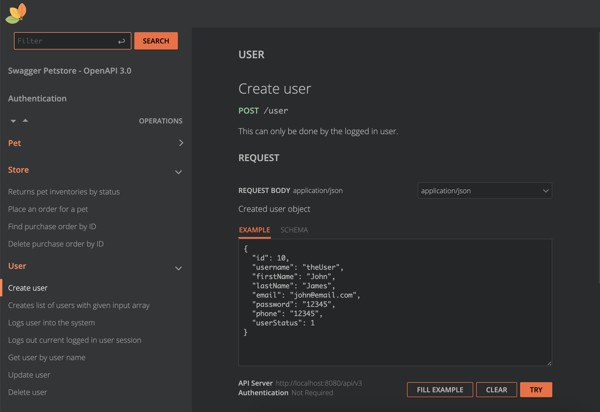

= Rapidoc Spring Boot Library
:toc:

*TLDR:* Modern Swagger UI for your Open Api specification in Spring Boot services.

== Who is expected to use this library?

- you have OpenApi Specification file for your API;
- you use https://github.com/OpenAPITools/openapi-generator/tree/master/modules/openapi-generator-maven-plugin[OpenApi Code Generator plugin];
- you want Swagger UI to be based on original OpenApi Specification file;
- you like how https://rapidocweb.com/index.html[RapiDoc] UI looks like;
- you have Spring Boot application.

== How UI looks like?

Or have a look here: https://rapidocweb.com/examples/petstore-extended.html

== How to configure?

. *[Important]* Remove SpringDoc and Swagger UI dependencies
+
Make sure that there is no `org.springdoc : springdoc-openapi-ui` and `org.webjars : swagger-ui` dependencies on classpath.

. Add dependency `com.playtika.services : rapidoc-spring-boot`
+
--
NOTE: Skip adding `<version>` for dependency if you are using Infra Bom 6.??+ version.

[source,xml]
----
<dependency>
    <groupId>com.playtika.services</groupId>
    <artifactId>rapidoc-spring-boot</artifactId>
    <version>insert_version_here</version>
</dependency>
----
--

. Configure properties
+

|===
|Property |Description |Default value

|`swagger.rapidoc.enabled`
|Enables/disables autoconfiguration for Rapidoc.
|`true`

|`swagger.rapidoc.open-api-spec.file-name`
|Name of the Open Api Spec file.
|`openapi.yaml`

|`swagger.rapidoc.open-api-spec.path`
|Path to the Open Api Spec file inside `/src/main/resources` folder.
|`/openapi/`

|===

== Available endpoints

Library exposes the following endpoints:

- `/v3/api-docs` -- provides Open Api Specification file;
- `/swagger-ui.html` -- provides RapiDoc UI for the Open Api Specification.

== Demo project

Demo project is located in module `rapidoc-spring-boot-demo`. Start application and hit `http://localhost:8080/swagger-ui.html` in browser.

